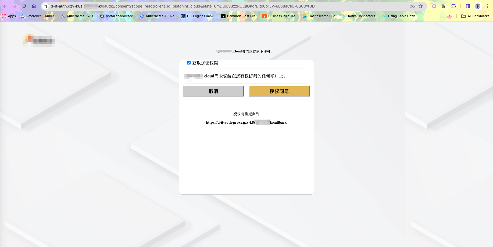

# Ingress 统一认证代理

## 认证流程

> 1.访问资源服务https://d-it-upms-demo-3.gzv-k8s.xyz.com/user/1
> 
> 2.OAuth2-Proxy校验Session认证信息，因为没有相关认证信息，跳转到授权访问认证地址`nginx.ingress.kubernetes.io/auth-signin`进行授权访问
>
> 3.登录
> 4.登录成功，访问OAuth2服务（OAuth2 authorize endpoint ）申请用户授权访问
> 
> 5.用户授权访问，访问OAuth2服务（OAuth2 authorize endpoint ）获取授权码
> 
> 6.获取到授权码成功，访问OAuth2服务将访问转发到redirect_uri（OAuth2 Proxy回调接口），OAuth2 Proxy根据code获取access token，并新建认证session
> 
> 7.获取最开始的访问地址（根据state获取），并将访问转发到该地址
> 
> 8.此时能正常访问
> 

--------------------------------

## 使用
## 1.获取镜像
## 1.1使用已有镜像
```shell
docker pull xin8/oauth2-ingress-proxy:latest
docker tag xin8/oauth2-ingress-proxy:latest gzv-reg.lucky.xyz/library/oauth2-proxy:latest
```
### 1.2构建镜像
```shell
docker buildx create --name multiple-platfoems --use
docker build -f Dockerfile-Build -t gzv-reg.lucky.xyz/library/oauth2-proxy:latest .
```

### 2.token校验配置，使用JWT或者数字签名认证
### 基于OAuth2 authorize endpoint实现

#### 2.1 JWT token校验——本地解析token

##### 环境变量配置

| 名称                                 | 描述                            | 必填 | 默认值         |
|------------------------------------|-------------------------------|----|-------------
| `OAUTH2_ISSUER_ENDPOINT`           | OAuth2服务端点                    | 否  |             |
| `OAUTH2_TOKEN_KEY_JP`              | 获取JWT解析Key，请求返回key所在的JSONPath | 否  | $.data.key  |
| `OAUTH2_TOKEN_KEY_SM2_PRIVATE_KEY` | 获取JWT解析Key，AES Key用于解析返回加密Key | 否  |             |
| `OAUTH2_TOKEN_KEY_SM2_PUBLIC_KEY`  | 获取JWT解析Key，AES Iv用于解析返回加密Key  | 否  |             |
| `OAUTH2_URI_PARAM_TOKEN_NAME`      | 支持将token放到url参数之中的对应参数名称      | 否  | authz       |
| `OAUTH2_APP_ID`                    | 获取JWT解析Key，数字签名校验App Id       | 否  |             |
| `OAUTH2_APP_SECRET`                | 获取JWT解析Key，数字签名校验App Secret   | 否  |             |
| `OAUTH2_JWT_VALID_METHODS`         | 解析JWT校验算法                     | 否  | HS512,HS256 |

#### 2.2 数字签名token校验

##### 环境变量配置

| 名称                                | 描述                    | 必填 | 默认值                                          |
|-----------------------------------|-----------------------|----|----------------------------------------------
| `OAUTH2_SIGN_METHOD`              | 数字签名算法                | 否  | HmacSHA256                                   |
| `OAUTH2_APP_ID`                   | 获取密钥配置信息签名的app id     | 是  |                                              |
| `OAUTH2_APP_SECRET`               | 获取密钥配置信息签名的app secret | 是  |                                              |

#### 2.3 Redis Session配置

##### 环境变量配置

| 名称            | 描述                                         | 必填 | 默认值        |
|---------------|--------------------------------------------|----|------------
| `REDIS_TYPE`  | Redis类型单机、主从模式配置：STANDALONE，集群模式配置：CLUSTER | 否  | STANDALONE |
| `REDIS_NODES` | Redis节点如：ip1:port1,ip2:port2               | 是  |            |
| `REDIS_USER`  | Redis用户                                    | 否  |            |
| `REDIS_PWD`   | Redis密码                                    | 是  |            |
| `REDIS_DB`    | Redis DB                                   | 3  |            |

### 3. k8s部署OAuth2代理认证服务OAuth2-Proxy

configmap配置文件部署文件如下：
```yaml
kind: ConfigMap
apiVersion: v1
metadata:
  name: oauth2-proxy-config
data:
  GIN_MODE: "release"
  SERVER_PORT: '6666'
  # OAuth2 token endpoint 如果在同一个集群则可配置集群内部通信地址（需修改）
  OAUTH2_ACCESS_TOKEN_ENDPOINT: "http://it-auth.dev-xyz-cloud.svc.cluster.local:21080/oauth2/token"
  # OAuth2 authorize endpoint （需修改）
  OAUTH2_AUTHORIZATION_ENDPOINT: "https://d-it-auth.gzv-k8s.xyz.com/oauth2/authorize"
  # 当前代理认证服务OAuth2-Proxy外网访问地址（需修改）
  OAUTH2_PROXY_ENDPOINT: "https://d-it-auth-proxy.gzv-k8s.xyz.com"
  # 授权认证成功之后转发地址参数（无需修改）
  OAUTH2_REDIRECT_URI_PARAM_NAME: "ru"
```

secret配置文件部署文件如下：
```yaml
kind: Secret
apiVersion: v1
metadata:
  name: oauth2-proxy-secret
stringData:
  # redis连接类型 single：单机模式，cluster：集群
  REDIS_TYPE: "cluster"
  # redis节点，如果是集群模式则host1:port1,host2:port2
  REDIS_NODES: "172.28.155.106:6379,172.28.232.136:6379,172.28.250.115:6379,172.28.51.152:6379,172.28.70.148:6379,172.28.98.8:6379"
  # redis登录账号
  REDIS_USER: ""
  # redis密码
  REDIS_PWD: "Y21WYVhNdGMzaFkycw"
  # 单机模式下redis数据库
  REDIS_DB: "3"
  # redis客户端名称，默认ingress-oauth2-proxy
  REDIS_CLI_NAME: "ingress-oauth2-proxy"

  # OAuth2 授权范围
  OAUTH2_SCOPE: "openapi"
  # OAuth2 客户端名称
  OAUTH2_CLIENT_ID: "lcx"
  # OAuth2 客户端密码
  OAUTH2_CLIENT_SECRET: "pi.s#t!xxx"
  # OAuth2 客户端对应的app id
  APP_ID: "f2aa0059a6e4456f8bac775c4fd***.xyz"
  # OAuth2 客户端对应的SM2 private hex key
  OAUTH2_TOKEN_KEY_SM2_PRIVATE_KEY: "125809f6819ANBgkqpisshkiG***.xyz.***AASCAT4wggE6AgEAAkEAl3cpw0oz"
  # OAuth2 客户端对应的SM2 public hex key
  OAUTH2_TOKEN_KEY_SM2_PUBLIC_KEY: "anFSRDdMejFralRVVExxyzJFWmx2MUI4"
  # 当前app id 的aes iv
  AES_IV: "MVNxZmlxWjExMxyz"
  # 获取JWT 解析key url
  OAUTH2_ISSUER_ENDPOINT: "http://it-auth.dev-xyz-cloud.svc.cluster.local:21080"
  # 获取JWT 解析key请求返回key对应的JSONPath
  OAUTH2_TOKEN_KEY_JP: "$.data.key "
  # 当前应用 app id
  OAUTH2_APP_ID: "xxxxxxxxxxxxxxxx"
  # 当前应用 app secret
  OAUTH2_APP_SECRET: "xxxxxxxxxxxxxxxxxxxxxxxxxxxxxxxxxxxxxxxxxxxxxxxxxxxxxxxxxxxxxxxx"
  # JWT解析后验证算法
  OAUTH2_JWT_VALID_METHODS: "HS512,HS256"
  # 支持URL传递token，对应参数名称
  OAUTH2_URI_PARAM_TOKEN_NAME: "authz"
  # 数字签名算法，获取token key和解密密钥使用的签名算法
  OAUTH2_SIGN_METHOD: "HmacSHA256"
```

### 代理认证服务部署配置

```yaml
kind: Namespace
apiVersion: v1
metadata:
  name: xyz-oauth2
  labels:
    kubernetes.io/metadata.name: xyz-oauth2
---
apiVersion: apps/v1
kind: Deployment
metadata:
  name: oauth2-proxy
  labels:
    app.lucky.xyz/instance: oauth2-proxy
    app.lucky.xyz/name: oauth2-proxy
spec:
  replicas: 1
  selector:
    matchLabels:
      app.lucky.xyz/instance: oauth2-proxy
      app.lucky.xyz/name: oauth2-proxy
  template:
    metadata:
      labels:
        app.lucky.xyz/instance: oauth2-proxy
        app.lucky.xyz/name: oauth2-proxy
    spec:
      containers:
        - name: oauth2-proxy
          image: gzv-reg.lucky.xyz/library/oauth2-proxy:latest
          imagePullPolicy: Always
          envFrom:
            - configMapRef:
                name: oauth2-proxy-config
            - secretRef:
                name: oauth2-proxy-secret
          ports:
            - name: http-port
              containerPort: 6666
          livenessProbe:
            tcpSocket:
              port: http-port
            initialDelaySeconds: 30
            timeoutSeconds: 5
            periodSeconds: 30
            successThreshold: 1
            failureThreshold: 5
          readinessProbe:
            tcpSocket:
              port: http-port
            initialDelaySeconds: 30
            timeoutSeconds: 5
            periodSeconds: 10
            successThreshold: 1
            failureThreshold: 5
---
apiVersion: v1
kind: Service
metadata:
  name: oauth2-proxy
  labels:
    app.lucky.xyz/instance: oauth2-proxy
    app.lucky.xyz/name: oauth2-proxy
spec:
  type: ClusterIP
  selector:
    app.lucky.xyz/instance: oauth2-proxy
    app.lucky.xyz/name: oauth2-proxy
  ports:
    - name: oauth2-proxy
      protocol: TCP
      port: 80
      targetPort: 6666
```

--------------------------------

### 4. 统一认证代理配置

配置示例如下：

```yaml
kind: Ingress
apiVersion: networking.k8s.io/v1
metadata:
  name: d-it-upms-demo
  annotations:
    # 代理认证服务登录地址 [代理认证服务地址]/login
    nginx.ingress.kubernetes.io/auth-signin: https://d-it-auth-proxy.gzv-k8s.xyz.com/login
    # 代理认证服务校验token地址 [代理认证服务地址]/check
    nginx.ingress.kubernetes.io/auth-url: http://oauth2-proxy.xyz-oauth2.svc.cluster.local:80/check
    # cookie跨域domain
    nginx.ingress.kubernetes.io/cors-allow-origin: https://*.xyz.com
    # 对代理认证服务返回缓存，认证成功时状态码为200 200 202 缓存30分钟
    nginx.ingress.kubernetes.io/auth-cache-duration: 200 201 202 30m
    nginx.ingress.kubernetes.io/auth-cache-key: $remote_user$http_authorization
    nginx.ingress.kubernetes.io/auth-keepalive-share-vars: 'true'
    nginx.ingress.kubernetes.io/auth-response-headers: Authorization,X-Auth-Request-User-Id,X-Auth-Request-User-Name,X-Auth-Request-Tenant-Id
    nginx.ingress.kubernetes.io/auth-signin-redirect-param: ru
    nginx.ingress.kubernetes.io/cors-allow-credentials: 'true'
    nginx.ingress.kubernetes.io/enable-cors: 'true'
    nginx.ingress.kubernetes.io/enable-global-auth: 'true'
spec:
  ingressClassName: nginx-ing
  tls:
    - hosts:
        - d-it-upms-proxy-11.gzv-k8s.xyz.com
      secretName: gzv-k8s
  rules:
    - host: d-it-upms-proxy-11.gzv-k8s.xyz.com
      http:
        paths:
          - path: /
            pathType: Prefix
            backend:
              service:
                name: it-upms
                port:
                  number: 21080
```

